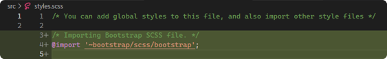
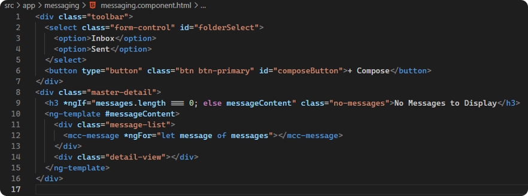
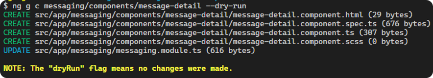

# Angular Bootcamp

This project is designed as an Angular Bootcamp, focusing on introducing key concepts in Angular and getting you hands on as quickly as possible. In this project, we will build a Messaging Client, where we can experiment with many different features of Angular. For additional resources and tutorials, the official Angular website and documentation is always the best place to start.

- [Angular.io](https://angular.io/)
- [What Is Angular](https://angular.io/guide/what-is-angular)
- [Getting Started](https://angular.io/start)
- [Tour of Heroes](https://angular.io/tutorial)

# Table of Contents

- [Angular Bootcamp](#angular-bootcamp)
- [Table of Contents](#table-of-contents)
- [What is Angular?](#what-is-angular)
  - [Core Building Blocks](#core-building-blocks)
    - [Modules](#modules)
    - [Components](#components)
    - [Directives](#directives)
    - [Services](#services)
    - [Routing](#routing)
  - [Angular CLI](#angular-cli)
    - [CLI Best Practices](#cli-best-practices)
- [Setup Instructions](#setup-instructions)
- [Installing the Angular CLI](#installing-the-angular-cli)
- [Creating a Project](#creating-a-project)
  - [Running the Application](#running-the-application)
  - [Exploring your new Angular application](#exploring-your-new-angular-application)
  - [The Root Module](#the-root-module)
    - [The @NgModule Decorator](#the-ngmodule-decorator)
    - [The Routing Module](#the-routing-module)
  - [Our First Component](#our-first-component)
  - [Angular Components](#angular-components)
    - [The @Component Decorator](#the-component-decorator)
    - [App Prefix and Component Selectors](#app-prefix-and-component-selectors)
    - [Updating Our First Component](#updating-our-first-component)
  - [Templates](#templates)
    - [Interpolation](#interpolation)
    - [Property Binding](#property-binding)
    - [Event Binding](#event-binding)
    - [Two-Way Binding](#two-way-binding)
- [Directives](#directives-1)
  - [Structural Directives](#structural-directives)
  - [Attribute Directives](#attribute-directives)
- [Building our App](#building-our-app)
  - [Creating the Feature Module](#creating-the-feature-module)
  - [Creating the Root Component for our Feature](#creating-the-root-component-for-our-feature)
    - [Messaging Component](#messaging-component)
    - [Messaging Template](#messaging-template)
    - [Messaging Module](#messaging-module)
  - [Creating the Routes for our Feature Module](#creating-the-routes-for-our-feature-module)
    - [Messaging Routing Module](#messaging-routing-module)
  - [Configuring Routes](#configuring-routes)
  - [Route Redirect](#route-redirect)
- [Building the Layout](#building-the-layout)
  - [Adding ngBootstrap](#adding-ngbootstrap)
    - [ng add](#ng-add)
  - [Creating the Toolbar](#creating-the-toolbar)
  - [Adding Toolbar Items](#adding-toolbar-items)
  - [Creating the Master-Detail View](#creating-the-master-detail-view)
    - [Ng-Template](#ng-template)
  - [Create the Message Component](#create-the-message-component)
  - [Using the Message Component](#using-the-message-component)
- [Models in Angular](#models-in-angular)
  - [The Message Model](#the-message-model)
  - [The Barrel](#the-barrel)
- [Inputs and Outputs](#inputs-and-outputs)
  - [Data Flow](#data-flow)
  - [Adding our Input](#adding-our-input)
  - [Typing our Messages](#typing-our-messages)
  - [Angular Inputs](#angular-inputs)
  - [Rendering our Input](#rendering-our-input)
  - [Angular Outputs](#angular-outputs)
- [Building our Message component](#building-our-message-component)
  - [Angular Pipes](#angular-pipes)
  - [Cleaning up our Output](#cleaning-up-our-output)
- [Building our Message Detail Component](#building-our-message-detail-component)
  - [Updating Messaging to track Selected Message](#updating-messaging-to-track-selected-message)
- [Angular Services](#angular-services)
  - [Creating our service](#creating-our-service)
  - [Adding our datasource](#adding-our-datasource)
  - [Observable Data Services](#observable-data-services)
  - [Consuming our Observable Data Service](#consuming-our-observable-data-service)
- [Reactive Forms](#reactive-forms)
  - [Building our Compose Message Component](#building-our-compose-message-component)
  - [Angular Forms](#angular-forms)
  - [Adding our Reactive Form](#adding-our-reactive-form)
    - [Grouping form controls](#grouping-form-controls)
  - [Reactive Form Validation](#reactive-form-validation)
  - [Handling Form Submission](#handling-form-submission)
- [Unit Testing](#unit-testing)

# What is Angular?

<p align="center">
  
</p>

Angular is an application design framework and development platform for creating efficient and sophisticated single-page apps.

- Built with TypeScript
- Component-based framework for building scalable web applications
- Collection of well-integrated libraries that cover a wide variety of features, including routing, forms management, client-server communication, and more
- Suite of developer tools to help you develop, build, test, and update your code

## Core Building Blocks

<p align="center">
  
</p>

The core building blocks in Angular are:

- Modules
- Components
- Directives
- Routing
- Services

### Modules

<p align="center">
  
</p>

- The main building block of an application
- Contains logic that pertains to a feature such as Components, Services, Routing, Directives, and more.
- Applications must have at least one, but can have many
- Typically used to encapsulate all logic pertaining to a particular feature
- Can import other modules

As we explore these building blocks, think of modules as the containers for your application and features.
<p align="center">
  
</p>

### Components

<p align="center">
  
</p>

- The most vital building block
- Contains:
  - An HTML Template that instructs Angular how to render the component
  - A TypeScript class which encapsulates the data and logic
  - A Stylesheet specific to this component
- Forms part of the DOM tree

Components are part of our modules and make up a View Hierarchy.
<p align="center">
  
</p>

### Directives

<p align="center">
  
</p>

- A class that can be added as an attribute to an HTML element or Component
- Extends or transforms an element and its children

Directives work alongside components within a module to enhance DOM elements.
<p align="center">
  
</p>

### Services

<p align="center">
  
</p>

- Classes that encapsulate re-usable logic
- Managed by Angular's Dependency Injector
- Performs logic not specific to a component (rendering data, reacting to user, etc.)
- Typically serve as a Data Layer, handling API requests and cached data

Angulars dependency injector provides instances of services to our components. If services are configured at the root and not provided explicitly within a module, the dependency injector will manage a singleton instance of the service.
<p align="center">
  
</p>

### Routing

<p align="center">
  
</p>

- Manages which component should be rendered based on the URL state
- Enables Lazy-Loading of modules to improve load times and bundle size

Each module can define it's own route configuration. This tells Angular which components should be rendered in a router-outlet when the URL state changes. Effective use of routing and lazy loading modules can drastically improve your applications performance.
<p align="center">
  
</p>

## Angular CLI

The Angular CLI is a command-line interface tool that you use to initialize, develop, scaffold, and maintain Angular applications directly from a command shell.

Common Commands:
|||
| ----------- | ----------- |
| ng new `<app-name>` | Creates a new Angular project by the given app name (Best practice: Use kebab-case) |
| ng generate module `<module-name>` or ng g m `<module-name>` | Creates a new Angular module by the given name |
| ng generate component `<component-name>` or ng g c `<component-name>` | Creates a new Angular component by the given name |
| ng serve | Serves the application to your localhost with the default port 4200 |
| ng test | Executes the project unit tests |

### CLI Best Practices

Do:

- Name your app and all files with kebab-case
- Generate all Angular building blocks using the CLI to start with the boilerplate that follows best practices
- Observe and adopt best practices introduced through the CLI and the boilerplate for each building block

Don't:

- Include `Module`, `Component`, `Service`, `Directive`, etc. in the name when using the CLI. It will do this for you following Angular Best Practice Nomenclature.

# Setup Instructions

Install the following tools:

- [Visual Studio Code](https://code.visualstudio.com/)
- [Node.JS](https://nodejs.org/en/)
- [Google Chrome](https://www.google.com/chrome/)

# Installing the Angular CLI

With Node.JS installed, open a terminal window and run the following command:

```bash
npm install -g @angular/cli
```

This will install the Angular CLI globally on your machine. You can check which version you have installed with the following command:

```bash
ng version
```

# Creating a Project

With the Angular CLI installed, run the following command to create a new Angular project:

```bash
ng new messaging-client --prefix mcc
```

The CLI will prompt you to configure the project. Make the following selections:

|||
| ----------- | ----------- |
| Do you want to enforce stricter type checking… | Y |
| Would you like to add Angular routing? | Y |
| Which stylesheet format would you like to use? | SCSS |

## Running the Application

To run your application, run the following command in the VSCode Terminal

```bash
ng serve
```

This will compile your app and host it locally. To see the app, navigate in your browser to `http://localhost:4200`. What you will see is the starter template the Angular CLI provides for you when you create a new Angular application.

<p align="center">
  
</p>

## Exploring your new Angular application

<p align="center">
  
</p>

## The Root Module

<p align="center">
  
</p>

- All Angular applications include **at least one** Module
- This is the Root Module, typically named the `AppModule`
- The module is decorated with the `@NgModule` decorator
- The Root Module will include one option specific only to our top-level module: the `Bootstrap` option
- Note the inclusion of an `AppRoutingModule`. We will touch on this momentarily

### The @NgModule Decorator

<p align="center">
  
</p>

The `@NgModule` Decorator allows you to configure metadata for a module. The most common include:

|||
| ----------- | ----------- |
| declarations | The set of components, directives, and pipes (declarables) that belong to this module. |
| imports | The set of NgModules whose exported declarables are available to templates in this module. |
| exports | The set of declarables in this NgModule that can be used in the template of any component that is part of an NgModule that imports this NgModule. Exported declarations are the module's public API. |
| providers | The set of injectable objects that are available in the injector of this module. |

### The Routing Module

<p align="center">
  
</p>

In Angular, the best practice is to load and configure the router in a separate, top-level module that is dedicated to routing and imported by the root AppModule.

By adding Angular Routing when we generated the app, the CLI has produced this module for us.

We will explore Routing in depth in a later section, for now simply be aware that this exists and is currently empty.

## Our First Component

<p align="center">
  
</p>

- The `@Component` decorator adds metadata for Angular about this class.
  - It is **Imported** from the Angular Core library
  - This metadata tells Angular how to render this component
- The `AppComponent` class is **Exported** so that it can be referenced outside of this file.
- By default, the CLI creates our first property, title, when it creates our `AppComponent`


## Angular Components

<p align="center">
  
</p>

Angular components are made up of 4 files

- A TypeScript File (`.ts`) which drives the components behavior
  - Includes a **Class** with the `@Component` decorator.
- A Template (`.html`) which defines how the component is rendered
  - This can also be defined inline as part of the `@Component` decorator, but for enterprise applications it is best practice to define the template in a separate .html file.
- A Stylesheet (`.scss`) which defines the styles for the component
  - The stylesheets generated by the Angular CLI will default to the CSS format configured in the `angular.json` configuration file (set initially by your selection when you use the CLI to generate a new application)
  - By default, Angular uses View Encapsulation to scope a components styles to Only that component. This is done by appending a unique ID to every element in the template at runtime.
- A Test file (`.spec.ts`) which contains the configuration and individual tests for the component.

### The @Component Decorator

<p align="center">
  
</p>

While the `@Component` decorator includes many configuration options, the three primary options you will see configured on any component are:

|||
| ----------- | ----------- |
| selector | A CSS selector that defines how the component is used in a template. HTML elements in your template that match this selector become instances of the component. |
| template or templateUrl | An HTML template that instructs Angular how to render the component. This can be provided inline or as a path to the HTML file. |
| styles or styleUrls (Optional) | An optional set of CSS styles that define the appearance of the template's HTML elements. This can be provided inline or as a path to the stylesheet(s) |

### App Prefix and Component Selectors

When we generated our app, we added the `--prefix mcc` option. This sets the prefix for all the Components and Directives we generate using the CLI. You can see this prefix in their `selectors`.

<p align="center">
  
</p>

Notice how our component `selector` starts with `mcc-`. Every component requires a CSS selector. A selector instructs Angular to instantiate this component wherever it finds the corresponding tag in template HTML. It’s important that our components have a **unique** selector to reduce the likelihood that they will conflict with component selectors from 3rd party libraries or with the native selectors supported by HTML.

Follow best practices by naming your selectors with kebab-case and using our app prefix to increase uniqueness.

### Updating Our First Component

Remove everything from `app.component.html` and replace it with:

```html
Hello!
```

As soon as you save your change the site will automatically refresh and render your changes. This is Angulars Live-Reload feature at work. Combined with a well-designed application, it will help shorten the feedback-loop for developers. Simply make your changes, save, and see your changes rendered immediately

<p align="center">
  
</p>

## Templates

- Angular extends HTML with additional syntax that lets you insert dynamic values from your component.
- It will automatically update the rendered DOM when your component’s state changes.
- Templates support 4 types of **Data Binding**:
  1. `Interpolation` – displays the result of an evaluated expression
  2. `Property Binding` – assigns the result of an expression to an HTML attribute
  3. `Event Binding` – binds an HTML event to a function in your component
  4. `Two-Way Binding` – combines property and event binding to create a two-way data-flow. Typically used for inputs.

<p align="center">
  
</p>

### Interpolation

Interpolation tells Angular to render the value of a given expression. Using the existing `title` property of our `app.component.ts`, add the following to our `app.component.html`

```html
{{ title }}
```

Your app should reload and render the value of `title` in the DOM. Interpolation evaluates expressions, so you can add any valid JavaScript between the curly braces. Give these a try:

```html
{{ title + "!" }}
{{ 1 + 2 + 3 }}
{{ [1,2,3].length }}
```

Here are some more examples:

<p align="center">
  
  
</p>

### Property Binding

Property Binding allows us to use values from our component to set attributes on HTML Elements or other Angular Components. As those values change in our component, the attribute is updated and Angular re-renders the view. Add an `h3` element to your `app.component.html` with a `title` attribute set to our components title property:

```html
<h3 [title]="title">{{ title }}</h3>
```

The `title` attribute in HTML provides the text for the tooltip that appears when you hover over the element. When your app refreshes, you should see the value of our title property rendered when you hover over the h3 element.
Notice the `[ ]` around the attribute name. This tells Angular that the value provided inside the quotes is an expression and should be evaluated. Remove the square brackets and you will notice that the tooltip renders the literal string: `title`


<p align="center">
  
</p>
<p align="center">
  
  
</p>

### Event Binding

Event Binding allows us to register functions in our component to events emitted by HTML Elements or other Angular Components. Add a function to your `app.component.ts`:

```typescript
public setTitle() {
	this.title = "Hello World!";
}
```

Then add a button to your `app.component.html`:

```html
<button (click)="setTitle()">Set Title</button>
```

When the button is clicked, the `setTitle` function will be triggered. Because we are using interpolation to render the `title`, as soon as the `setTitle` function updates the value of the `title` property, you will see the rendered value update on your page.

<p align="center">
  
</p>
<p align="center">
  
  
</p>


### Two-Way Binding
Two-Way Binding combines property and event binding to create a loop between a component and its template. The easiest way to make use of it is to use Angulars `ngModel` directive. Before you can do so, you will need to `import` the `FormsModule` it is a part of into your `AppModule`. 

First, add the `import` statement to your `app.module.ts`.

```typescript
import { FormsModule } from '@angular/forms';
```

Notice how the `@angular` imports are grouped together at the top of the file. This is a practice the Angular team specifically built into the CLI, so I recommend you follow it.

Next, add the `FormsModule` you just imported into the `imports` array of the `NgModule` decorator:

```typescript
imports: [
    BrowserModule,
    FormsModule,
    AppRoutingModule
  ],
```

Now that we've imported the `FormsModule`, we can utilize the NgModel directive. Add an `input` to your `app.component.html`:
```html
<input type="text" [(ngModel)]="title">
```
Take note of the `[( )]` around `ngModel`. This template syntax is sometimes referred to as the Banana-In-The-Box. It tells Angular that you want to set the value of this element to the property provided, as well as update the value anytime the property is updated outside of this element. 

When the app refreshes, you will see that the `input` has a starting value set to the value of your `title`. Type into the `input` and you will see the Interpolated `h3` element change as you update the value. Click the Set Title `button` and you will see that the `h3` element and your `input` are both updated.

<p align="center">
  
</p>
<p align="center">
  
  
</p>

# Directives

Additional functionality can be added to your templates with `directives`. You can use directives to perform a variety of tasks, such as dynamically modifying the DOM structure. You can also create your own custom directives to create custom user experiences.

There are two main types of directives:
- **Structural** – these alter the layout by adding, removing, or replacing elements in the DOM
- **Attribute** – these alter the appearance or behavior of an existing element in the DOM

## Structural Directives

The two primary examples of a structural directive are also the two most used directives in Angular:
- **\*ngFor** – tells Angular to repeat a given DOM element for each value in a list
- **\*ngIf** – tells Angular to only include a given DOM element if the given expression is true

To see these in action, let's add an array to our `app.component.ts`:

```typescript
public todos = ["Learn Angular!", "Demo ngIf", "Demo ngFor"];
```

In addition, lets add a function to remove items from our list:

```typescript
public removeTodo() {
	this.todos.pop();
}
```

<p align="center">
  
</p>

Now let's tell Angular to render our `todo` list and add a `button` to remove the last item from the list. Add the following to our `app.component.html`:

```html
<div *ngFor="let todo of todos">
	{{ todo }}
</div>
<button *ngIf="todos.length > 0" (click)="removeTodo()">Remove Todo</button>
```

Let's also add a message if there are no todos to display:

```html
<div *ngIf="todos.length === 0">All Todos Completed!</div>
```

When the app refreshes, you should see each item in the list rendered. This is our `*ngFor` at work. You should also see your button to remove them. When you click the button, you should see the last item of the list removed immediately.

Once all items of the list are removed, because of our `*ngIf` you will see the button disappear and a message that indicates that there are no more todos to display.

<p align="center">
  
  
  
  
</p>

## Attribute Directives

The most common attribute directives are:
- **NgClass** [`class.<css-class>`] – dynamically adds/removes CSS classes
- **NgStyle** [`style.<inline-style>`] – sets inline styles dynamically
- **NgModel** [`(ngModel)`] – adds two-way data binding to an HTML form element

We've used the `ngModel` directive already for our input. Let's add a conditional class to our button. Start by adding the following styles to our `app.component.scss`:

```scss
button {
	background-color: #2F80ED;
	color: #ffffff;
}

.disabled {
	background-color: #BDBDBD;
}
```

Next update the `app.component.html` by replacing the existing button with the following:

```html
<button [class.disabled]="todos.length === 0" (click)="removeTodo()">Remove Todo</button>
```

When the app refreshes, instead of the button disappearing when there are no more todos in the list, the expression assigned to the directive will resolve to true. At which point, the `disabled` class will be applied and we should see our `disabled` styles applied to the `button`.

<p align="center">
  
</p>
<p align="center">
  
</p>
<p align="center">
  
  
</p>

# Building our App

Now that we’ve got some of the basics down, let’s start building. The first thing we’ll do is build a Feature Module. The benefits of structuring our code into feature modules are:
- All code relevant to a particular feature can be organized into one container.
- Routing for each module allows for better organization and a cleaner `app-routing.module.ts`.
- Feature Modules can be configured for `Lazy-Loading`. This allows us to reduce the initial bundle size by only including what is necessary for the user to reach their desired route.
  - Other modules can either be loaded in the background as the user gets started with the app.
  - Or we can configure the modules to only be loaded on demand, when the user attempts to reach a route in that module.

## Creating the Feature Module
Open your VSCode terminal and enter the following command:

```bash
ng g m messaging --dry-run
```

This will create a new `module` in the app directory. However, because we used the `--dry-run` option, we will get a chance to see what will be changed in the repository before committing to it.

<p align="center">
  
</p>

Notice that the CLI will create a directory by the same name of the module in the app directory. This is the default behavior for most Angular building blocks that the CLI can generate for you. Because this was an intentionally behavior added by the Angular team, I suggest we follow the pattern.

Now to follow through with the command, remove `--dry-run` and run it again

```bash
ng g m messaging
```

You should now see a new `messaging` directory with our `messaging.module.ts` inside. 

<p align="center">
  
</p>

This is our feature module and it will include all the relevant files for our Messaging feature.

## Creating the Root Component for our Feature

Next, we will add the component that will serve as the root of our feature module. This will be the routed component that serves as the entry point for the Messaging feature.

Run the following command to preview the creation of our component:

```bash
ng g c messaging --dry-run
```

The CLI will display the outcome of this command for us. A few things to note:
- Because a `messaging` directory already exists, it will add our new component to it
- This will generate the 4 files that make up our component
- It will also update the `messaging.module.ts`, as **all** components **must** be declared within a module. The CLI looks for the closest module to add our component to.

<p align="center">
  
</p>

Now to follow through with the command, remove `--dry-run` and run it again

```bash
ng g c messaging
```

You should now see all the files relevant to our messaging component in the `messaging` directory.

<p align="center">
  
</p>

Let’s take a look at what the CLI has set up for us. 

### Messaging Component

If you look at our `messaging.component.ts`, you can see the boilerplate the CLI generates for us.

<p align="center">
  
</p>

A few things to note:
- The selector includes our `mcc-` prefix by default, followed by our components name
- By default, our component implements the Angular `OnInit` lifecycle hook. We will dig into these later in our session.

### Messaging Template

If you look at our `messaging.component.html`, you can see the boilerplate template the CLI generates for us.

<p align="center">
  
</p>

There’s not much going on here, the CLI simply gives us a message that our component is working. This way, if we include its selector somewhere in our app, we at least know that it is properly rendered.

### Messaging Module

One of the more interesting things the CLI did for us when generating our component is set up its declaration in our `messaging.module.ts`.

<p align="center">
  
</p>

Remember, all Components must be included as a declaration in a module. The CLI will start in the directory you generate the component, then move up until it finds the nearest `NgModule`.

When it finds an `NgModule`, it adds the new component to the `declarations` array.


## Creating the Routes for our Feature Module

We've created our feature module and root feature component, but when we run the app, we're still not making use of them anywhere.

Let's set up routing for our module, then configure the application to route to our feature when the application is loaded.

The CLI can handle this for us as well. It is best practice to configure routing as part of a secondary `NgModule` that is imported by our feature module. In your terminal, enter the command:

```bash
ng g m messaging/messaging-routing --flat --module=messaging --dry-run
```

There’s a lot going on here, so let’s look at what our output is and break it down. This command will give us the following output:

<p align="center">
  
</p>

A few things to note here:
- The name of the module, `messaging/messaging-routing`, includes the `messaging/` path in it. The CLI generates items from the root folder, which it recognizes as `src/app`. In order to generate components in sub-directories, you must include their paths relative to `src/app` in the name.
- The `--flat` option tells the CLI not to create a sub-directory named `messaging-routing`. Instead, it adds the module to the `messaging/` path specified by the name.
- The `--module=messaging` option tells the CLI to include the generated item in the specified module. In this case, it will add our `messaging-routing` module in the `imports` array of the messaging module, `messaging.module.ts`

Now to follow through with the command, remove `--dry-run` and run it again

```bash
ng g m messaging/messaging-routing --flat --module=messaging
```

You should see a new file in the messaging directory, `messaging-routing.module.ts`

<p align="center">
  
</p>

Let’s look at what the CLI added and updated for us.

### Messaging Routing Module

If you look at our `messaging-routing.module.ts`, you can see the boilerplate the CLI generates for us.

<p align="center">
  
</p>

This is a simple `NgModule`, so we will need to add the routes and configure them ourselves.

If we look at the changes made to the `messaging.module.ts`, we can see that our `MessagingRoutingModule` has been imported and added to the `imports` array.

<p align="center">
  
</p>

Once our routes are set up, this is what will include our configured in the `MessagingModule`.

## Configuring Routes

Let's configure our messaging routes. In the `messaging-routing.module.ts`, first add the following imports. Because the Router imports are Angular imports, let's put them together at the top of the file. We will then separate our local imports by a new line:

```typescript
import { RouterModule, Routes } from '@angular/router';

import { MessagingComponent } from './messaging.component';
```

Next, add the following routes array beneath the `imports` and above the `@NgModule` decorator:

```typescript
const routes: Routes = [
	{ path: 'messaging', component: MessagingComponent }
];
```

This configures the path `http://localhost:4200/messaging` to render the `MessagingComponent`. Before we see this in action, we need to do a few more things. 

Next, add the following import to our `MessagingRoutingModule` `imports` array. This tells Angular that we want to register these routes for our feature module, or in this case our child module.

```typescript
imports: [
	...
	RouterModule.forChild(routes)
]
```

Your `messaging-routing.module.ts` should look something like this:

<p align="center">
  
</p>

The next thing we need to do is make our routes available to our root module. Because we want this module to be loaded when the app is initially loaded, we will do so by importing our feature module into the root `AppModule`.

Add the following `import` to our `app.module.ts`

```typescript
import { MessagingModule } from './messaging/messaging.module';
```

And then add `MessagingModule` to the `imports` array

```typescript
imports: [
	…
	MessagingModule
],
```

We have our feature module routes set up, we've imported our module into the root module, but Angular still doesn't know where to render our routes when they appear in the URL. We can fix this by adding a `RouterOutlet` to our `AppComponent`.

In the `app.component.html`, add the following element

```html
<router-outlet></router-outlet>
```

This tells Angular to render routed components where this element is found. When you save your changes and navigate to `http://localhost:4200/messaging` you should see our `MessagingComponent` rendered!

<p align="center">
  
</p>

## Route Redirect

However, if we navigate to `http://localhost:4200/` without our path, we'll still only see the `AppComponent` rendered. Because we want to render our `MessagingComponent` by default, let's set up a redirect to that path.

Open our `app-routing.module.ts` and add the following path to our `routes` array

```typescript
const routes: Routes = [
	{ path: '', redirectTo: 'messaging', pathMatch: 'full' }
];
```

This configures our root path, `http://localhost:4200/`, to redirect to our messaging path, `http://localhost:4200/messaging`. Now when we load our application, we should see our `MessagingComponent` rendered!

**Note:** While we set this module up to be eagerly loaded on launch, as we add additional feature modules, you would only want to eagerly load your first module.
To improve load times and our bundle size, we would set up our secondary feature modules as `Lazy-Loaded` Modules. We will touch on this later in the course.

# Building the Layout

Now that we've configured our feature module and our routes, let's work on implementing an aesthetically pleasing UI.

## Adding ngBootstrap

To make styling things a bit quicker, we will add the UI Library `ngBootstrap`. This is a popular choice among .NET developers transitioning to Angular.
Another excellent choice would be `Angular Material`, which is maintained by Google and extremely customizable.

To add `ngBootstrap`, run the following command in your VSCode terminal

```bash
ng add @ng-bootstrap/ng-bootstrap
```

Adding the library with the Angular CLI instead of NPM will perform a few additional things for us. If the library has an Angular `Schematic`, the CLI will make additional changes outlined by the library to your project in order to get you up and running quicker.<sup>ℹ️</sup>

Let’s peek at what the CLI did for us.

### ng add

The Angular CLI gives us the following output when it adds the library

<p align="center">
  
</p>


You can see it added the library, then updated a few files. Let’s see what changes it made to each of these.

The first thing the CLI did was add the necessary dependencies to our `package.json`

<p align="center">
  
</p>

This change mirrors what adding the library with NPM would have also done for us.

In addition, the CLI has updated several other files for us:
- `styles.scss` - Imported the Bootstrap SCSS stylesheet so that it is available globally to all components

<p align="center">
  
</p>

- `app.module.ts` - Imported the ngBootstrap `NgbModule` and added it to the `imports` array of our `AppModule`

<p align="center">
  
</p>

- `polyfills.ts` - Added the necessary polyfills to support the library

<p align="center">
  
</p>

These changes will set us up to start using the library right away.

## Creating the Toolbar

The next thing we'll do is build our toolbar. To get started, let's first clear out the `Hello!` text from our `app.component.html`. This will leave only the `<router-outlet>` element, which in turn will leave only our rendered route component in the view.

<p align="center">
  
</p>

Next let's update our `messaging.component.html` content. Replace the current `p` element with the following div

```html
<div class="toolbar"></div>
```

Now add the following SCSS to our `messaging.component.scss`<sup>ℹ️</sup>

```scss
:host {
  display: flex;
  flex-direction: column;
  
  .toolbar {
    display: flex;
    align-items: center;
    justify-content: space-between;
    height: 50px;
    background: #FFF;
    box-shadow: 0px 2px 5px rgba(0, 0, 0, 0.25);
    padding: 0 35px;
  }
}
```

One thing to note here, the use of the `host` selector. This is a special selector that tells Angular to apply styles to the Component Selector in the DOM.

In this case, these styles will be applied to the `<mcc-messaging>` element. You can use the Chrome DevTools, select this element in the Elements tab, and review the styles applied to confirm that they match our host styles.

<p align="center">
  
</p>

You could always add a container around the entire template and style that, but this approach reduces unnecessary DOM elements.

Next, let's update the app background so the toolbar and all content containers stand out a bit more.

We can apply global styles like this to our `styles.scss`. Add the following styles below our Bootstrap import

```scss
html, body {
  height: 100%;
  background-color: #F2F2F2;
}
```
<p align="center">
  
</p>

Our toolbar should stand out a bit more now. Next let's add some of our toolbar items.<sup>ℹ️</sup>

## Adding Toolbar Items

We’ll start by adding a `select` element with an `Inbox` and `Sent` option to our toolbar. Add the following to our toolbar `div` in `messaging.component.html`

```html
<select class="form-control" id="folderSelect">
  <option>Inbox</option>
  <option>Sent</option>
</select>
```
<p align="center">
  
</p>

We'll make use of Bootstrap classes here, as well as apply our own styles. In our `messaging.component.scss`, nested in the `toolbar` selector, add the following styles for the `folderSelect` element <sup>ℹ️</sup>

```scss
#folderSelect {
  height: 34px;
  width: 156px;
}
```
<p align="center">
  
</p>

Next let's add our Compose button. Add the following to our toolbar `div` in `messaging.component.html`

```html
<button type="button" class="btn btn-primary" id="composeButton">+ Compose</button>
```
<p align="center">
  
</p>

Again, we'll make use of Bootstrap classes here, as well as apply our own styles. In our `messaging.component.scss`, nested in the `toolbar` selector, add the following styles for the `composeButton` element <sup>ℹ️</sup>

```scss
#composeButton {
  height: 35px;
  width: 120px;
}
```
<p align="center">
  
</p>

When we save all our changes and the app refreshes, we should have our Toolbar, with a select and a Compose button!

<p align="center">
  
</p>

## Creating the Master-Detail View

Next we'll create our Master-Detail View, with our list of items on the left and the details for any selected item on the right.

Let's start by adding a new `div` to our `messaging.component.html`

```html
<div class="master-detail"></div>
```
<p align="center">
  
</p>

Then we'll add the following styles to our `messaging.component.scss` <sup>ℹ️</sup>

```scss
:host {
  …
  height: 100%;

	…
  .master-detail {
    height: 100%;
  }
}
```
<p align="center">
  
</p>

Next, let's add a `messages` array that will help drive some behavior in our template. In our `messaging.component.ts`, add the following

```typescript
public messages = [];
```
<p align="center">
  
</p>

Then in our `messaging.component.html`, add the following to our `master-detail div` <sup>ℹ️</sup>

```html
<h3 *ngIf="messages.length === 0" class="no-messages">No Messages to Display</h3>
```
<p align="center">
  
</p>

Notice we're making use of the `*ngIf` structural directive to only render our `h3` when our `messages` array length is equal to zero.

Next let's add some style to our `h3`. In our `messaging.component.scss`, add the following nested in our `master-detail` selector <sup>ℹ️</sup>

```scss
.master-detail {
	display: flex;
	...

	.no-messages {
		align-self: center;
		width: 100%;
		text-align: center;
	}
}
```
<p align="center">
  
</p>

We should now have a message displayed when there are no messages to display to the user!

<p align="center">
  
</p>

Now let's add some data so that we have something to render in our view. Update the `messages` array in our `messaging.component.ts` to include the following `JSON` objects <sup>ℹ️</sup>

```typescript
public messages = [
	{
		sender: 'John Smith',
		recipient: 'Jane Doe',
		dateSent: new Date('2021-04-01T14:48:00.000Z'),
		subject: 'Lorem ipsum dolor sit amet',
		message: 'Consectetur adipiscing elit, sed do eiusmod tempor incididunt ut labore et dolore magna aliqua.'
	}, {
		sender: 'James Allan',
		recipient: 'Jane Doe',
		dateSent: new Date('2021-04-01T15:34:00.000Z'),
		subject: 'Consectetur adipiscing elit',
		message: 'Sed do eiusmod tempor incididunt ut labore et dolore magna aliqua.'
	},
];
```
<p align="center">
  
</p>

Now let's add the containers for when we do have data in our `messages` array. In `messaging.component.html`, update the `*ngIf` of our `h3` to include an `else` clause

```html
<h3 *ngIf="messages.length === 0; else messageContent" class="no-messages">No Messages to Display</h3>
```

Then add an `ng-template` that contains our new divs <sup>ℹ️</sup>

```html
<ng-template #messageContent>
  <div class="message-list"></div>
  <div class="detail-view"></div>
</ng-template>
```
<p align="center">
  
</p>

### Ng-Template

An `ng-template` is a special element that allows you to write re-usable HTML code. When you assign an `ng-template` a `#templateVariable`, you can then use that template variable to reference it in an `*ngIf` or an `ng-container`. The `ng-template` tag will not be rendered in the DOM.

Template variables are very powerful for creating variables in your component templates that can be referenced anywhere inside that template.

Next let's add some styles to our new container elements. Nested in the `master-detail` selector of our `messaging.component.scss`, let's add the following <sup>ℹ️</sup>

```scss
.message-list {
	flex: 0 1 460px;
	border-right: 1px solid #CCCCCC;
}

.detail-view {
	flex: 1 1 auto;
}
```
<p align="center">
  
</p>

When you save your changes and the app reloads, we should see our two containers with a divider in the middle.

<p align="center">
  
</p>

## Create the Message Component

Next, we will create the Message component. This will be the card used in the message list on the left-hand side of our `master-detail` view.

```bash
ng g c messaging/components/message --dry-run
```
<p align="center">
  
</p>

This will create a `components` directory in the `messaging/` path then a subdirectory by the same name as the component, add our component files, and add the component to our `MessagingModules` `imports` array. Now let's run it without the `--dry-run` flag <sup>ℹ️</sup>

```bash
ng g c messaging/components/message
```

## Using the Message Component

Now let's use our new component. In our `messaging.component.html`, update our `message-list div` to make use of our MessageComponent via its selector <sup>ℹ️</sup>

```html
<div class="message-list">
  <mcc-message *ngFor="let message of messages"></mcc-message>
</div>
```
<p align="center">
  
</p>

This will create a new instance of our `MessageComponent` for each of the messages found in the messages array of our `MessagingComponent`.

When our app reloads, we should see our Toolbar, Master-Detail view, and two `MessageComponents` rendered in our message list container

<p align="center">
  
</p>

# Models in Angular

## The Message Model

Both our `MessagingComponent` and `MessageComponent` will now need to work with our data. To leverage the power of `TypeScript`, let’s create a model for our Message objects.

Let’s start by adding a `models` directory to our `messaging` directory.
**Take care to ensure this is created in the correct directory or our imports will not work in a later section!**

<p align="center">
  
</p>

Next, let’s create a new file in our `models` directory and call it `message.ts`

<p align="center">
  
</p>

In our `message.ts` file, let’s add the following interface, which represents our message object. <sup>ℹ️</sup>

```typescript
export interface Message {
	sender: string;
	recipient: string;
	dateSent: Date;
	subject: string;
	message: string;
}
```
<p align="center">
  
</p>

We’ll leverage this `type` for type-checking our `message` object, especially as it’s passed between our components.

## The Barrel

Now let’s add a Barrel to our `models` directory. Including a barrel in our model and service directories simplifies the import paths for items in those directories.

Start by adding an `index.ts` to the models directory.

<p align="center">
  
</p>

Then add the following line to that file

```typescript
export * from './message';
```

All this does is re-export any of the exports defined in the files referenced. The advantage of this is when we `import` models defined by any file in this directory, now we can group them into a single `import` statement.

For example, say we also had a `todo.ts` file in our `models` directory that exported a `Todo` interface. Instead of the imports from each looking like this:

```typescript
import { Message } from './models/message';
import { Todo } from './models/todo';
```

We can use the barrel to shorten this to: <sup>ℹ️</sup>

```typescript
import { Message, Todo } from './models';
```

# Inputs and Outputs

Next, we will need to feed our messages into their `MessageComponent` instances and notify our `MessagingComponent` when an event occurs from our `MessageComponent`.

In Angular, there are two primary mechanisms for data and events to flow between components:
- `Inputs` and `Outputs`
- Angular `Services`

We’ll explore Services in a later section, for our current need, Inputs and Outputs would be best. <sup>ℹ️</sup>

## Data Flow
A common pattern in Angular is sharing data between a parent component and one or more child components. 

You can implement this pattern by using the `@Input()` and `@Output()` directives. These directives support a `One-Way Data Flow` in our view hierarchy: **Data flows Down while Events bubble Up**

<p align="center">
  
</p>

## Adding our Input

Let's add the following `message` input to our `message.component.ts`. We will give it a default value of an empty object cast to a `Message` type.

```typescript
@Input() public message: Message = {} as Message;
```
<p align="center">
  
</p>

This will also require you to `import` the `Input` decorator from `@angular/core`

```typescript
import { Component, Input, OnInit } from '@angular/core';
```

As well as the `Message` type from our `models` directory <sup>ℹ️</sup>

```typescript
import { Message } from '../../models';
```

## Typing our Messages

Next, let’s update our `messages` array in our `messaging.component.ts` so that it is properly typed as a `Message` array. The only thing we need to do to the property here is add the type to the `messages` declaration

```typescript
public messages: Message[] = [
...
```
<p align="center">
  
</p>

However, we will also have to `import` our `Message` type

```typescript
import { Message } from './models';
```

Then we will update our `message-list` container in our `messaging.component.html` to pass each message down to its instance of the `MessageComponent` <sup>ℹ️</sup>

```html
<mcc-message *ngFor="let message of messages" [message]="message"></mcc-message>
```
<p align="center">
  
</p>

## Angular Inputs

Let’s take a closer look at our new Input and how it’s used from our parent template. Notice the `[]` around our `message` input name, which tells angular to evaluate the value of the `message` variable passed to it.

<p align="center">
  
</p>


## Rendering our Input

Finally, let’s replace the boilerplate `p` element from our `message.component.html` and instead render data from our `input`. 

```html
{{ message.sender }}
```
<p align="center">
  
</p>

This will showcase that our messages are indeed being passed down from our parent to our child. <sup>ℹ️</sup>

<p align="center">
  
</p>

Let’s fix our `message-list` by applying some `flexbox` styles in `messaging.component.scss` <sup>ℹ️</sup>

```scss
.message-list {
	...
	display: flex;
	flex-direction: column;
	...
}
```
<p align="center">
  
</p>

Now our message components should appear as expected again.

<p align="center">
  
</p>

## Angular Outputs

We don’t quite have a use-case for outputs just yet, but let’s add one to our `MessageComponent` to demonstrate how they work.

Start by adding an `Output` to our `message.component.ts`.

```typescript
@Output() public buttonClicked = new EventEmitter<string>();
```

We will need to add `Output` and `EventEmitter` to the existing import from `@angular/core`

```typescript
import { Component, EventEmitter, Input, OnInit, Output } from '@angular/core';
```

Next, we'll add a function that will cause the `output` to emit a value

```typescript
public onButtonClick() {
	this.buttonClicked.emit(this.message.subject);
}
```
<p align="center">
  
</p>

We need to add a `button` to our `message.component.html` that will trigger our function in the `MessageComponent`

```html
<button class="btn btn-primary" (click)="onButtonClick()">Emit Subject From Output!</button>
```
<p align="center">
  
</p>

And then set up a function in our `messaging.component.ts` that we can trigger from this `output`.

```typescript
public outputEmitted(subject: string) {
	alert(`Subject emitted: ${subject}`);
}
```
<p align="center">
  
</p>

**Note:** we're using backticks here to create a string literal. This is one of the cleanest ways to build a string in TypeScript.

Finally, let's wire up our `Output` from the `MessageComponent` to our new function in the `MessagingComponent` by updating our `mcc-message` in the `messaging.component.html` <sup>ℹ️</sup>

```html
<mcc-message *ngFor="let message of messages" [message]="message" (buttonClicked)="outputEmitted($event)"></mcc-message>
```
<p align="center">
  
</p>

When our app reloads, we should now see a button for each MessageComponent in the list. When you click the button for each message, we should see that messages subject displayed in an alert!

<p align="center">
  
  
</p>

Let’s take a closer look at our new Output and how it’s used from our parent template.

<p align="center">
  
</p>

# Building our Message component

Now that we have our `messages` passed down to our Message component, let’s set up the template to render it properly.

Let’s start by replacing the content of our `message.component.html` the following

```html
<div class="main">
	<div id="sender">
		<strong>{{ message.sender }}</strong>
	</div>
	<div id="subject">
		<strong>{{ message.subject }}</strong>
	</div>
	<div id="message">
		{{ message.message }}
	</div>
</div>
<div>
	<div id="date">
		{{ message.dateSent | date:'shortDate'  }}
	</div>
	<div id="time">
		{{ message.dateSent | date:'shortTime' }}
	</div>
</div>
```
<p align="center">
  
</p>

Then we’ll update our `message.component.scss` by adding the following styles

```scss
:host {
	display: flex;
	justify-content: space-between;
	width: 448px;
	height: 100px;
	color: #6B6B6B;
	background-color: white;
	border-radius: 4px;
	padding: 8px 16px;
	box-shadow: 0px 2px 5px rgba(0, 0, 0, 0.25);
	cursor: pointer;

	.main {
		max-width: 320px;
	}

	#subject,
	#message {
		white-space: nowrap;
		text-overflow: ellipsis;
		overflow: hidden;
		max-width: 100%;
	}
}
```
<p align="center">
  
</p>

Finally, in our `messaging.component.scss`, we’ll add the following styles to our `mcc-message` selector itself, nested within our `.message-list` selector. We'll also add some padding to the `.message-list` element <sup>ℹ️</sup>

```scss
.message-list {
	...
	padding: 8px;

	mcc-message {
		margin-bottom: 8px;
	}
}
```
<p align="center">
  
</p>

## Angular Pipes

There’s one thing to note here that we’re using for the first time. `Angular Pipes`.
Pipes transform strings, currency amounts, dates, and other data for display. They are simple functions you can use in template expressions to accept an input value and return a transformed value.

Some commonly used built-in pipes include:
- `DatePipe`: Formats a date value according to locale rules.
- `UpperCasePipe`: Transforms text to all upper case.
- `LowerCasePipe`: Transforms text to all lower case.
- `CurrencyPipe`: Transforms a number to a currency string, formatted according to locale rules.
- `DecimalPipe`: Transforms a number into a string with a decimal point, formatted according to locale rules.
- `PercentPipe`: Transforms a number to a percentage string, formatted according to locale rules.

In our case, we had one `Date` property that we needed to display on separate lines. On one we display the `Date` in `M/d/yy` format, on the other we display the time in `hh:mm a` format.

We made use of our same property for both lines with a different format specified for Angulars Date Pipe

<p align="center">
  
</p>

Our app should have reloaded so we can see our changes. We should now have some nicely rendered messages in our master-detail view

<p align="center">
  
</p>

## Cleaning up our Output

Great! Everything’s looking good… except we’ve just removed some of the code we wrote to demonstrate Angular Outputs. Let’s go ahead and clean that up.

Start by removing the `Output` we added to our `message.component.ts`.
```diff
- @Output() public buttonClicked = new EventEmitter<string>();
```

As well as the `Output` and `EventEmitter` imports that are no longer needed
```diff
- import { Component, EventEmitter, Input, OnInit, Output } from '@angular/core';
+ import { Component, Input, OnInit } from '@angular/core';
```

Then we'll remove the function that was emitting a value through our `output`
```diff
- public onButtonClick() {
-   this.buttonClicked.emit(this.message.subject);
- }
```

Next we'll remove the function in our `messaging.component.ts` that was triggered by the `output`.
```diff
- public outputEmitted(subject: string) {
-   alert(`Subject emitted: ${subject}`);
- }
```

Finally, we'll remove the `Event Binding` currently configured on the `mcc-message` element in the `messaging.component.html` <sup>ℹ️</sup>
```diff
- <mcc-message *ngFor="let message of messages" [message]="message" (buttonClicked)="outputEmitted($event)"></mcc-message>
+ <mcc-message *ngFor="let message of messages" [message]="message"></mcc-message>
```

# Building our Message Detail Component

Next, we will create the Message Detail component. This will be the right-hand side of our master-detail view.

```bash
ng g c messaging/components/message-detail --dry-run
```

<p align="center">
  
</p>

This will create a directory in the `messaging/components` path by the same name as the component, add our component files, and add the component to our `MessagingModules` `imports` array. Now let’s run it without the `--dry-run` flag <sup>ℹ️</sup>

```bash
ng g c messaging/components/message-detail
```

Now let's update our new `MessageDetail` component to render the details for a message.

We'll start by replacing the contents of the `message-detail.component.ts` with the following TypeScript

```typescript
import { Component, Input } from '@angular/core';

import { Message } from '../../models';

@Component({
  selector: 'mcc-message-detail',
  templateUrl: './message-detail.component.html',
  styleUrls: ['./message-detail.component.scss']
})
export class MessageDetailComponent {
  @Input() public message: Message = {} as Message;
}
```

Then replace the contents of the `message-detail.component.html` with the following HTML

```html
<div id="subject">
  {{ message.subject }}
</div>
<div id="metadata">
  <div>{{ message.sender }}</div>
  <div>{{ message.dateSent | date:'short' }}</div>
</div>
<div id="message">
  {{ message.message }}
</div>
```

And finally, replace the contents of the `message-detail.component.scss` with the following SCSS

```scss
:host {
  display: flex;
  flex-direction: column;
  color: #6B6B6B;
  background-color: white;
  border-radius: 4px;
  padding: 16px;
  box-shadow: 0px 2px 5px rgba(0, 0, 0, 0.25);

  #subject {
    font-weight: bold;
    font-size: 24px;
    line-height: 28px;
    padding: 8px;
    margin-bottom: 8px;
  }

  #metadata {
    font-size: 16px;
    line-height: 120%;
    padding: 16px;
    border-bottom: 1px solid #CCC;
    margin-bottom: 16px;
  }

  #message {
    padding: 16px;
  }
}
```

## Updating Messaging to track Selected Message

Now that we have our Detail view set up, we need know when to render it and which message to display the details for.

To do so, we will update our `Messaging` component to track the selection of a message. First, let's update `messaging.component.ts` to include the following property:

```typescript
public selectedMessage: Message | null = null;
```

Then let's update our `messaging.component.html` to display a message in our `detail-view` `div` if there is no message selected

```html
<div class="detail-view">
  <h4 *ngIf="!selectedMessage">Please select a message.</h4>
</div>
```

To center our `h4`, let's update the `messaging.component.scss` and add the following styles to the `.detail-view` selector:

```scss
.detail-view {
  ...
  display: flex;
  justify-content: center;
  align-items: center;
  padding: 8px;
}
```

Now we need to add a `function` that we can use in `event binding` for the `click` event of a message in our master list. In our `messaging.component.ts` add the following function:

```typescript
public selectMessage(message: Message) {
  this.selectedMessage = this.selectedMessage !== message ? message : null;
}
```

**Note:** we're using the `ternary operator` here to conditionally set `selectedMessage`. If the message selected is not the same message that was previously selected, then go ahead and set it. Otherwise, clear the `selectedMessage` by setting it to `null`.

Then we can update our `mcc-message` element in `messaging.component.html` to bind the `click` event to our `function`, as well as conditionally apply a class if the message is selected.

```html
<mcc-message *ngFor="let message of messages" [class.selected]="message === selectedMessage" [message]="message" (click)="selectMessage(message)"></mcc-message>
```

Let's add some styling for that conditional `selected` class. Nest the following styles in the `mcc-message` selector of our `messaging.component.scss`:

```scss
mcc-message {
  ...
  user-select: none;

  &.selected {
    border: 2px solid #00A9E0;
  }
}
```

Finally, we need to add the `mcc-message-detail` element to our `messaging.component.html` and pass it the selected message. We will update the existing `h4` to make use of the `*ngIf-else` pattern to only display it after a message has been selected.

```html
<h4 *ngIf="!selectedMessage; else detailContent">Please select a message.</h4>
<ng-template #detailContent>
  <mcc-message-detail [message]="selectedMessage!"></mcc-message-detail>
</ng-template>
```

**Note:** notice the `!` at the end of our property `selectedMessage` passed into the `mcc-message-detail message input`. This is a `non-null assertion operator`. Because our `selectedMessage` property in the `MessagingComponent` can be `null` but the `message input` of our `MessageDetailComponent` is only of type `Message`, we must assure the type-checker that it will not be null when we attempt to pass it into our `input`. We feel confident enough to do so because our component will only be rendered when `selectedMessage` is NOT null.

Now we should see our app rendering with our "Please select a message" text on load. When you select a message, we should see our `MessageDetailComponent` rendered. However it does not fill out `detail-view` area. 

Let's fix this by adding the following `mcc-message-detail` styles to the `.detail-view` selector of our `messaging.component.scss`:

```scss
.detail-view {
  ...

  mcc-message-detail {
    flex: 1 1 auto;
    height: 100%;
  }
}
```

Excellent! Now we're rendering our text indicating when no message is selected, rendering the message details when a message is clicked, updating the selected message when a new message is clicked, and clearing the selected message when a message is clicked twice.

# Angular Services

While rendering our hard-coded data is great, in real-world applications we will likely need to consume data from an API.

The standard practice in Angular is to delegate this responsibility to a `Service`. 

A `Service` is an instance of a class that you can make available to any part of your applicaiton using Angular's `dependency injection system`.

## Creating our service

The Angular CLI can help us when generating services as well. Let's run the following command and see what it'll do for us:

```bash
ng g s messaging/services/messaging --dry-run
```

The CLI will create a `services` directory in our existing `messaging` directory, then add the service file and it's spec file.

Let's go ahead and run this without out `--dry-run` flag:

```bash
ng g s messaging/services/messaging
```

If you look at our `messaging.service.ts`, you can see that it's a pretty straight-forward TypeScript class, with the exception of the `@Injectable` decorator.

The `@Injectable` decorator specifies that Angular can use this class in the `DI` system. The metadata, `providedIn: 'root'`, means that the `MessagingService` is visible throughout the application.

Because our service is specific to our Messaging feature, we should reduce it's scope to just our feature. To do so, let's remove the `providedIn` option from the `@Injectable` decorator of our `messaging.service.ts`:

```diff
- @Injectable({
-  providedIn: 'root'
- })
+ @Injectable()
```

Next, we'll add a `barrel` to our `services` directory by adding an `index.ts` to it with the following content:

```typescript
export * from './messaging.service';
```

Then we will scope our `MessagingService` to the Messaging feature by adding it to the `providers` array of the `messaging.module.ts`

```typescript
...
import { MessagingService } from './services';

@NgModule({
  ...
  providers: [
    MessagingService
  ]
})
```

This will tell the `DI` system that the Messaging feature should include it's own instance of the service. Because we removed the `providedIn: 'root'` configuration, it will be the only instance in our app.

## Adding our datasource

To imitate communicating with an external datasource, we can add create a `JSON` file in our `assets` directory and use Angular's `HttpClientModule` to read from it.

Let's create a new file, `data.json`, in our `src/assets` directory and fill it with the following `JSON`:

```json
{
  "messages": [
    {
      "sender": "Anthony Stark",
      "recipient": "Jane Doe",
      "dateSent": "2021-04-01T14:48:00.000Z",
      "subject": "Lorem ipsum dolor sit amet",
      "message": "Consectetur adipiscing elit, sed do eiusmod tempor incididunt ut labore et dolore magna aliqua. Tortor pretium viverra suspendisse potenti nullam ac. Donec pretium vulputate sapien nec sagittis aliquam malesuada bibendum arcu."
    }, {
      "sender": "Janet van Dyne",
      "recipient": "Jane Doe",
      "dateSent": "2021-04-01T15:34:00.000Z",
      "subject": "Morem ipsum dolor sit amet",
      "message": "Posuere ac ut consequat semper viverra nam. Felis eget velit aliquet sagittis id. Nullam eget felis eget nunc lobortis mattis aliquam faucibus. Enim diam vulputate ut pharetra sit amet aliquam."
    }, {
      "sender": "Henry Pym",
      "recipient": "Jane Doe",
      "dateSent": "2021-04-01T09:56:00.000Z",
      "subject": "Even morem ipsum dolor sit amet",
      "message": "Et ligula ullamcorper malesuada proin libero nunc consequat interdum. Est lorem ipsum dolor sit amet. Egestas tellus rutrum tellus pellentesque eu tincidunt. In fermentum et sollicitudin ac. Elit eget gravida cum sociis natoque penatibus et. Purus semper eget duis at tellus at."
    }, {
      "sender": "Robert Banner",
      "recipient": "Jane Doe",
      "dateSent": "2021-04-01T19:15:00.000Z",
      "subject": "Yet Morem ipsum dolor sit amet",
      "message": "Dis parturient montes nascetur ridiculus mus mauris. Lacus sed viverra tellus in hac habitasse platea dictumst. Tincidunt id aliquet risus feugiat in ante."
    }, {
      "sender": "Steven Rogers",
      "recipient": "Jane Doe",
      "dateSent": "2021-04-01T04:51:00.000Z",
      "subject": "Sum Morem ipsum dolor sit amet",
      "message": "Cursus mattis molestie a iaculis at erat pellentesque adipiscing. Vitae ultricies leo integer malesuada nunc vel risus. Ut lectus arcu bibendum at varius vel pharetra vel turpis. Eget lorem dolor sed viverra ipsum nunc aliquet bibendum enim. Consectetur a erat nam at."
    }, {
      "sender": "Jane Doe",
      "recipient": "Steven Rogers",
      "dateSent": "2021-04-01T07:47:00.000Z",
      "subject": "Runnen outa ipsum dolor sit amet",
      "message": "Nunc pulvinar sapien et ligula ullamcorper. Amet nulla facilisi morbi tempus iaculis urna id volutpat lacus. Fermentum iaculis eu non diam phasellus vestibulum lorem. Dui faucibus in ornare quam viverra orci sagittis eu volutpat."
    }
  ]
}
```

Next, we'll need to import the `HttpClientModule` into our `MessagingModule`. Open our `messaging.module.ts` to add the following:

```typescript
...
import { HttpClientModule } from '@angular/common/http';

...
imports: [
  ...
  HttpClientModule,
  ...
],
```

The `HttpClientModule` configures the dependency injector for `HttpClient`, which is the service provided by Angular for handling HTTP requests.

Now let's inject the `HttpClient` into our `MessagingService` by adding it to the `constructor`. Provided parameters in an a classes `constructor` tell Angular to request an instance of this type from the `dependency injector`.

Add the following import and replace the constructor in our `messaging.service.ts`

```typescript
...
import { HttpClient } from '@angular/common/http';
...

constructor(private http: HttpClient) { }
...
```

Now let's create a method to retrieve our data. In our `messaging.service.ts` add the following function:

```typescript
public getMessages() {
  this.http.get('assets/data.json').subscribe(data => {
    console.log((data as any).messages);
  });
}
```

Then in our `messaging.component.ts`, let's inject our service and call the `getMessages` method in our `OnInit` lifecycle hook:

```typescript
...
import { MessagingService } from './services';
...
constructor(private messagingService: MessagingService) { }

ngOnInit(): void {
  this.messagingService.getMessages();
}
...
```

Now when our app reloads, we should be able to inspect our `console` and see an array of 6 messages printed. Now to retrieve those messages for our component, we're going to explore a pattern known as `Observable Data Services`

## Observable Data Services

A popular pattern for retrieving and caching data in Angular services is to store the data in a `Subject` inside the service and expose it as an `Observable` to the rest of our application.

An `Observable` is a stream of data that notifies subscribers any time a new value is emitted by the Observable. It's not unlike a Promise, however where a Promise promises to return one value, an Observable can return many values over time. Making proper use of Observables pushes us towards writing code in a Reactive way, which is the intention of the Angular framework, as a Reactive Programming Framework.

A `Subject` is nothing more than a special kind of `Observable` that allows you to control the flow of data through it. You use a Subjects `next()` function to emit values through the Subject. There are a few types of Subjects that can be leveraged in different use-cases:

- `Subject` - new subscribers are notified of any New values emitted After the time of subscription
- `BehaviorSubject` - new subscribers are notified immediately of the last value emitted, with a default value set to guaruntee there will always be a last-value.
- `ReplaySubject` - new subscribers are notified immediately of the last `n` values emitted, where `n` is specified in the ReplaySubject instantiation and does not have a guarunteed last-value.

**Note:** Angular leverages a library called `RxJS` for it's Observables, Subjects, and Operators.

Let's build out our Observable data service and explore this in action. Start by adding the following to your `messaging.service.ts`

```typescript
import { BehaviorSubject } from 'rxjs';

import { Message } from '../models';
...
private _messages = new BehaviorSubject<Message[]>([]);
public messages$ = this._messages.asObservable();
...
```

Let's pause to discuss what's happening here. We are creating a BehaviorSubject to store our cached `messages`. We store the Subject as a `private` property so that our service is the only one that can push new values into it. We then have a public `messages$` property that exposes the Subject as an Observable. The `$` appended to the end is a standard hungarian notation for Observables.

Next, let's tell our `getMessages` function to push all new messages retrieved from our HTTP requests through our Subject:

```typescript
public getMessages() {
  this.http.get('assets/data.json').subscribe(data => {
    const messages = (data as any)?.messages || [];
    this._messages.next(messages);
  });
}
```

Now, when our `getMessages` function is called, it will make the HTTP request for data, we'll check if it has messages, and push those messages through our Subject. Anyone who is subscribed to our `messages$` Observable will be notified of this new array of messages. If data does not have `messages`, we will simply substitute them with an empty array.

## Consuming our Observable Data Service

Now that our service is set up to retrieve and cache messages from our datasource, let's consume those messages from our `MessagingComponent`. Update our `messaging.component.ts` by removing our hardcoded list of messages and assigning a property to our services `messages$` Observable:

```diff
-   public messages: Message[] = [
-    {
-      sender: 'John Smith',
-      recipient: 'Jane Doe',
-      dateSent: new Date('2021-04-01T14:48:00.000Z'),
-      subject: 'Lorem ipsum dolor sit amet',
-      message: 'Consectetur adipiscing elit, sed do eiusmod tempor incididunt ut labore et dolore magna aliqua.'
-    }, {
-      sender: 'James Allan',
-      recipient: 'Jane Doe',
-      dateSent: new Date('2021-04-01T15:34:00.000Z'),
-      subject: 'Consectetur adipiscing elit',
-      message: 'Sed do eiusmod tempor incididunt ut labore et dolore magna aliqua.'
-    },
-  ];
```

```typescript
...
import { Observable } from 'rxjs';
...
public messages$!: Observable<Message[]>;
...

ngOnInit(): void {
  this.messagingService.getMessages();
  this.messages$ = this.messagingService.messages$;
}
...
```

Next we need to update the `messaging.component.html` to know how to work with our new `messages$` Observable. Update the `h3` and `mcc-message` elements with the following:

```html
...
<h3 *ngIf="(messages$ | async)?.length === 0; else messageContent" class="no-messages">No Messages to Display</h3>
...
<mcc-message *ngFor="let message of messages$ | async" [class.selected]="message === selectedMessage" [message]="message" (click)="selectMessage(message)"></mcc-message>
...
```

Voila! We have data being retrieved from a datasource, stored in our Observable Data Service, and consumed by our components!

<!-- 
TODO: Document the following additional strategies of working with observables:
- Operators (Map, Filter, Debounce, etc)
- Managing Subscriptions
- Combining Observables 

**Note:** Since we may not be able to get too deep into any of these in this session, they are great candidates for an Advanced Angular session.
-->

# Reactive Forms

## Building our Compose Message Component

Next, we will create the Compose Message component. This will commandeer the right-hand side of our master-detail view when the user clicks the Compose button.

```bash
ng g c messaging/components/compose-message --dry-run
```

This will create a directory in the `messaging/components` path by the same name as the component, add our component files, and add the component to our `MessagingModules` `imports` array. Now let’s run it without the `--dry-run` flag <sup>ℹ️</sup>

```bash
ng g c messaging/components/compose-message
```

Now let's update our new `ComposeMessage` component to render a `Form` to create a new message.

We'll start by replacing the contents of the `compose-message.component.html` with the following HTML:

```html
<form>
  <div>
    <label for="to" class="form-label">To</label>
    <input type="text" class="form-control" id="to">
  </div>
  <div>
    <label for="subject" class="form-label">Subject</label>
    <input type="text" class="form-control" id="subject">
  </div>
  <div class="message-content">
    <label for="message" class="form-label">Message</label>
    <textarea class="form-control" id="message"></textarea>
  </div>
</form>
<button type="submit" class="btn btn-primary" id="send">Send</button>
```

And adding the following styles to our `compose-message.component.scss`:

```scss
:host {
  display: flex;
  flex-direction: column;
  color: #6B6B6B;
  background-color: white;
  border-radius: 4px;
  padding: 16px;
  box-shadow: 0px 2px 5px rgba(0, 0, 0, 0.25);

  form {
    flex: 1 1 auto;
    display: flex;
    flex-direction: column;

    #to,
    #subject,
    #message {
      margin-bottom: 16px;
    }

    .message-content {
      flex-grow: 1;
      display: flex;
      flex-direction: column;

      textarea {
        flex: 1 1 auto;
      }
    }
  }

  #send {
    align-self: flex-end;
    width: 120px;
    height: 35px;
  }
}
```

Now let's configure our `compose` button in `MessagingComponent` to display our `ComposeMessageComponent` when it is clicked. Update the `composeButton` in the `messaging.component.html` to add event binding for the `click` event

```html
<button type="button" class="btn btn-primary" id="composeButton" (click)="composeMessage()">+ Compose</button>
```

Then let's create a boolean to track our composing state and the `composeMessage()` function we just bound our click event to in our `messaging.component.ts`

```typescript
public composingMessage: boolean = false;
...
public composeMessage() {
  this.composingMessage = true;
  this.selectedMessage = null;
}
```

Finally, use that boolean to determine what should be rendered in our `messaging.component.html`. Here we'll update our `detail-view` div to have another `*ngIf` that either renders our details the way they are right now, or rendered our composing component. Replace the entire `detail-view` div with the following:

```html
<div class="detail-view">
  <ng-container *ngIf="!composingMessage; else composeMessageContent">
    <h4 *ngIf="!selectedMessage; else detailContent">Please select a message.</h4>
    <ng-template #detailContent>
      <mcc-message-detail [message]="selectedMessage!"></mcc-message-detail>
    </ng-template>
  </ng-container>
  <ng-template #composeMessageContent>
    <mcc-compose-message></mcc-compose-message>
  </ng-template>
</div>
```

Now let's discuss what all we did here:
- First, we have an `ng-container` element wrapping all our previous `detail-view` content. This is a virtual Angular component that is strictly used for structural purposes. Because the `ng-container` element itself is not rendered in the DOM, it can be used along with an `*ngIf` to affect what is rendered without having implications on our rendered DOM or the current styles.
- Our `ng-container` has an `else` on the `*ngIf`. As before, this will render the template it references when the `*ngIf` condition is not met.
- We added a new `ng-template` that contains our `mcc-compose-message` component selector. This will render our `ComposeMessageComponent` when the `composingMessage` boolean is true.

Just like our `mcc-message-detail` element needed some styles added to fill our `detail-view` area, so will our `mcc-compose-message` element. Let's simply add that selector to the existing styles applied to `mcc-message-detail` in our `messaging.component.scss`

```scss
mcc-message-detail,
mcc-compose-message {
  flex: 1 1 auto;
  height: 100%;
}
```

Now when our app reloads, we should be able to click our `Compose` button and see our `ComposeMessageComponent` `form`! But there is one additional quality of life improvement we can make. When we're composing, we should really not be able to select messages in our list. So let's add a little code to support that.

In our `messaging.component.ts`, let's update our `selectMessage` function to do Nothing if the `composingMessage` boolean is true:

```typescript
public selectMessage(message: Message) {
  if (this.composingMessage) return;
  this.selectedMessage = this.selectedMessage !== message ? message : null;
}
```

This will stop our app from being able to set a `selectedMessage`, but to the user the items still appear selectable. Let's add some styles to improve the user experience. In our `messaging.component.html`, let's add a conditional class to our `master-detail` div:

```html
<div class="master-detail" [class.composing]="composingMessage">
```

And in our `messaging.component.scss`, we'll change the cursor of our `mcc-message` elements by nesting the following style inside our current `.master-detail` selector:

```scss
.master-detail {
  ...

  &.composing mcc-message {
    cursor: not-allowed;
  }
  ...
}
```

## Angular Forms

Great! The app is coming together. But our form doesn't do anything yet. So let's work on that.

Angular provides two different approaches to handling user input through forms. 
Both capture user input events from the view, validate the user input, create a form model and data model to update, and provide a way to track changes.

However, they process and manage form data differently and each offers different advantages:

- `Reactive Forms` provide direct, explicit access to the underlying forms object model. Compared to template-driven forms, they are more robust: they're more scalable, reusable, and testable. If forms are a key part of your application, or you're already using reactive patterns for building your application, use reactive forms.

- `Template-driven Forms` rely on directives in the template to create and manipulate the underlying object model. They are useful for adding a simple form to an app, such as an email list signup form. They're easy to add to an app, but they don't scale as well as reactive forms. If you have very basic form requirements and logic that can be managed solely in the template, template-driven forms could be a good fit.

Most enterprise applications are going to fall more in-line with Reactive Forms, for the advantages mentioned above. So we will work through this approach for our applicaiton as well.

## Adding our Reactive Form

In this section, we are going to use Angular's `ReactiveFormsModule` to build out our form functionality.

Before we can do anything, we need to `import` the `ReactiveFormsModule` into our `MessagingModule`. Let's update our `messaging.module.ts` as follows:

```typescript
...
import { ReactiveFormsModule } from '@angular/forms';
...

imports: [
  ...
  ReactiveFormsModule,
  ...
],
...
```

Now we can start building our form. To do so, we will configure a group of controls in our `ComposeMessageComponent`.

### Grouping form controls

Forms typically contain several related controls. `Reactive forms` provide two ways of grouping multiple related controls into a single input form.

- A `form group` defines a form with a fixed set of controls that you can manage together. You can also nest form groups to create more complex forms.

- A `form array` defines a dynamic form, where you can add and remove controls at run time. You can also nest form arrays to create more complex forms. These are typically used when you need to build dynamic forms.

For our form, a `form group` would be most appropriate. We'll make use of the Angulars `FormBuilder` service to build out our form.

Let's start by injecting the `FormBuilder` service into our `compose-message.component.ts`

```typescript
...
import { FormBuilder } from '@angular/forms';
...

constructor(private formBuilder: FormBuilder) { }
...
```

Now we can create a form property and use the injected `formBuilder` instance to configure it. Add the following to our `compose-message.component.ts`

```typescript
public messageForm = this.formBuilder.group({
  to: "",
  subject: "",
  message: ""
});
```

This creates a new `FormGroup` with the `FormControls`: `to`, `subject`, and `message`. Their default values are provided and all are an empty string.

Now let's update our `compose-message.component.html` so that our inputs are bound to our new `FormGroup` and their respective `FormControls`

```html
<form [formGroup]="messageForm">
...
<input type="text" class="form-control" id="to" formControlName="to">
...
<input type="text" class="form-control" id="subject" formControlName="subject">
...
<textarea class="form-control" id="message" formControlName="message"></textarea>
...
```

To demonstate that our form group and it's controls are properly wired up and working, you can interpolate the `messageForm` value in your `compose-message.component.html` by adding the following html at the bottom:

```html
{{ messageForm.value | json }}
```

**Note:** Notice the use of yet another built-in Angular pipe: `json`. This is a Great tool for debugging, it will take the value you attach it to and render the JSON representation in the DOM.

Excellent! When the app reloads, we should now have inputs that are bound to our `Reactive FormGroup` and it's `FormControls`, and we should be able to see the value of that form changing as we type into the inputs.

Now to add some validation!

## Reactive Form Validation

Now that our form is all wired up, let's add validation on our `to` and `subject` form controls.

We want to validate that our `to` value is a valid email and that our `subject` has a value. We can do so by updating our `compose-message.component.ts` with the following:

```typescript
...
import { FormBuilder, Validators } from '@angular/forms';
...
public messageForm = this.formBuilder.group({
  to: ["", [Validators.required, Validators.email]],
  subject: ["", Validators.required],
  message: ""
});
...
```

The value provided for our controls in our `formBuilder` can either be the default value, or an array that provides a default value and, optionally, some additional options. One of those options is `validators`. Angular provides some built-in validators in the `ReactiveFormsModule` that can be accessed by importing `Validators`.

Now let's update our button to be `disabled` if our form is NOT valid. Update our `button` in the `compose-message.component.html` with the following:

```html
<button type="submit" class="btn btn-primary" id="send" [disabled]="!messageForm.valid">Send</button>
```

When our app reloads, we should see that the `Send` button is disabled until the `to` input has a valid email and the`subject` input has any value.

We could also display a validation message below each input to the user! This would create a better user experience. But I don't have time to write that up at the moment, so we will have to do that on the fly until I come back and add steps for it 😄

<!-- 
TODO: Add steps for Validation messages! 
-->

## Handling Form Submission

The last thing we need to do is handle the submission of the form. We can do so by binding a function to the `click` event of our `Send` button and using the `messageForm` value.

Update the `Save` button in our `compose-message.component.html` with the following:

```html
<button type="submit" class="btn btn-primary" id="send" [disabled]="!messageForm.valid" (click)="sendMessage()">Send</button>
```

Now let's add the `sendMessage()` function we just bound our button to in our `compose-message.component.ts`

```typescript
public sendMessage() {
  /* Normally, this is where we'd use a service to send our message: */
  alert(`Message Form Value: ${JSON.stringify(this.messageForm.value)}`);
}
```

And that's it! We now have a Reactive Form with some Validation and we're handling the Submit event of our form!

# Unit Testing

Under Construction! This section is a work in progress and will be added soon!

<!-- 
TODO: Add introduction, explanation, and instructions for writing unit tests! 
-->
